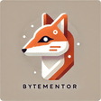

# ByteMentors

**ByteMentor** is a fully offline AI assistant (LLM) fine-tuned on educational materials from the ZHAW Data Science program.
It features a complete ETL pipeline for data processing, custom LLM fine-tuning using LoRA, and a web application for interactive use.

---

## Authors

- Azevedo Katharina (azevekat)
- Tomic Nikola (tomicnik)  
- Schwarz Damian (schwadam)  

---

## Overview

ByteMentor consists of a modular pipeline that:

- Extracts text from `.pdf`, `.docx`, and `.pptx` documents  
- Detects and translates non-English content to English  
- Generates structured Q&A pairs using a locally served language model  
- Filters and validates the output for fine-tuning use  

The resulting dataset is used to fine-tune the [`gemma-2b-it`](https://huggingface.co/google/gemma-2-2b-it) model using the [`SFTTrainer`](https://huggingface.co/docs/trl/en/index) from the TRL library — with **LoRA (Low-Rank Adaptation)** for efficient parameter tuning.

---

## Web Interface

ByteMentor includes a full-stack application:

- **Backend:** Flask (Python) API for serving data and running model inference. As well as user input cleanup.
- **Frontend:** Built with Vite + React + TypeScript for a responsive and fast UI  

## License

MIT License © 2025 ByteMentor Authors
