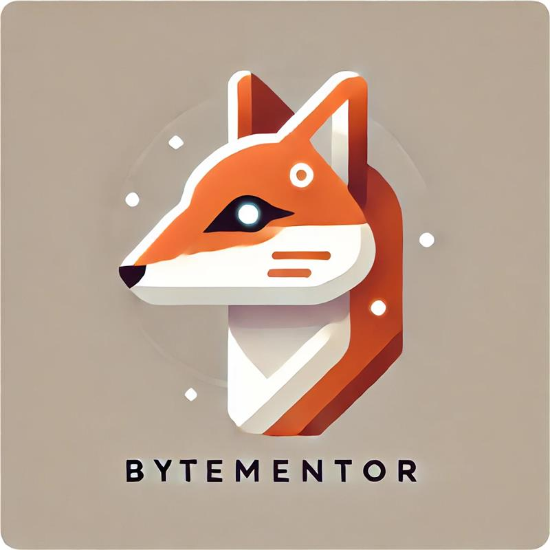

# ByteMentor
* Authors: azevekat, schwadam, tomicnik

## **Custom LLM for Research Papers on Data Science**

## **Project Overview**  
This project focuses on building a **custom Large Language Model (LLM)** trained on **research papers related to Data Science**. The goal is to create an AI system capable of **understanding, summarizing, and generating insights** from academic papers, assisting researchers in navigating the vast scientific literature.  

The pipeline includes:  
- **Scraping** and **processing** research papers from sources like **ArXiv**  
- **Extracting text from PDFs** and cleaning it  
- **Fine-tuning a transformer-based model** on the collected dataset  
- **Inference tasks**, including **summarization** and **question-answering**  
