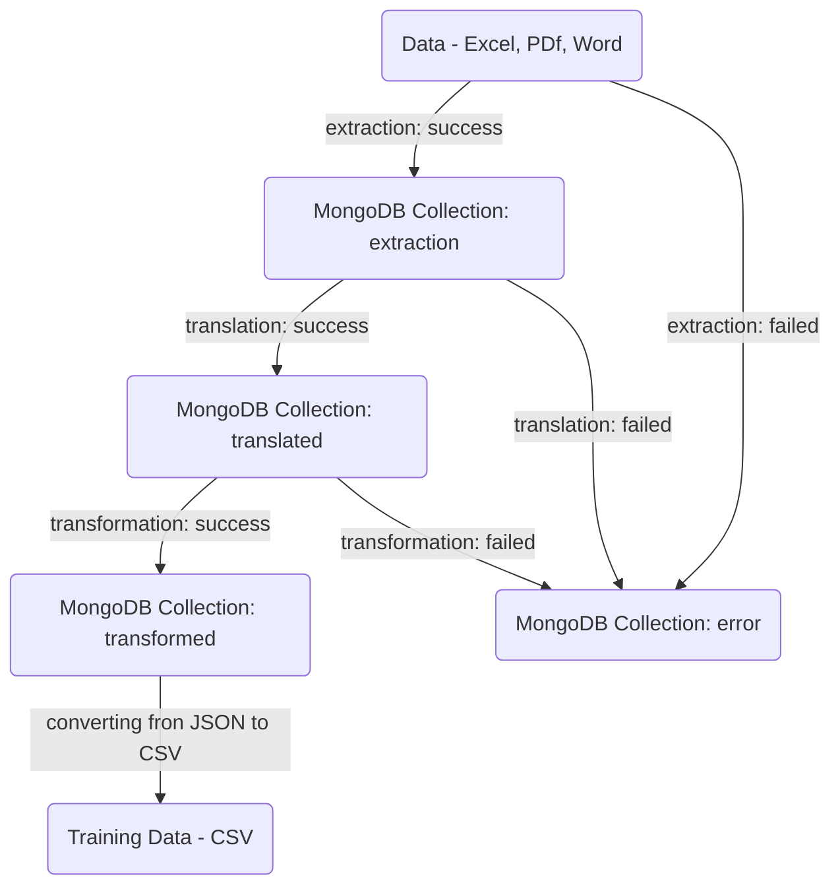

```mermaid
flowchart TD
    data_raw(Data - Excel, PDf, Word)
    data_training(Training Data - CSV)

    DB_extracted(MongoDB Collection: extraction)
    DB_translated(MongoDB Collection: translated)
    DB_transfromed(MongoDB Collection: transformed)
    DB_error(MongoDB Collection: error)

    data_raw --> |extraction: success| DB_extracted
    data_raw --> |extraction: failed| DB_error
    DB_extracted -->|translation: success| DB_translated
    DB_extracted --> |translation: failed| DB_error
    DB_translated -->|transformation: success| DB_transfromed
    DB_translated -->|transformation: failed| DB_error
    DB_transfromed --> |converting fron JSON to CSV| data_training

```